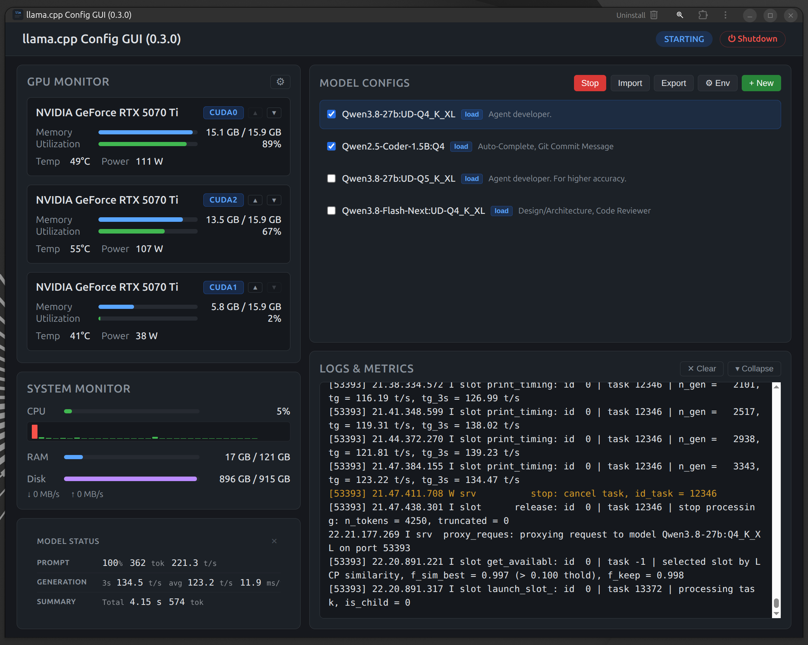
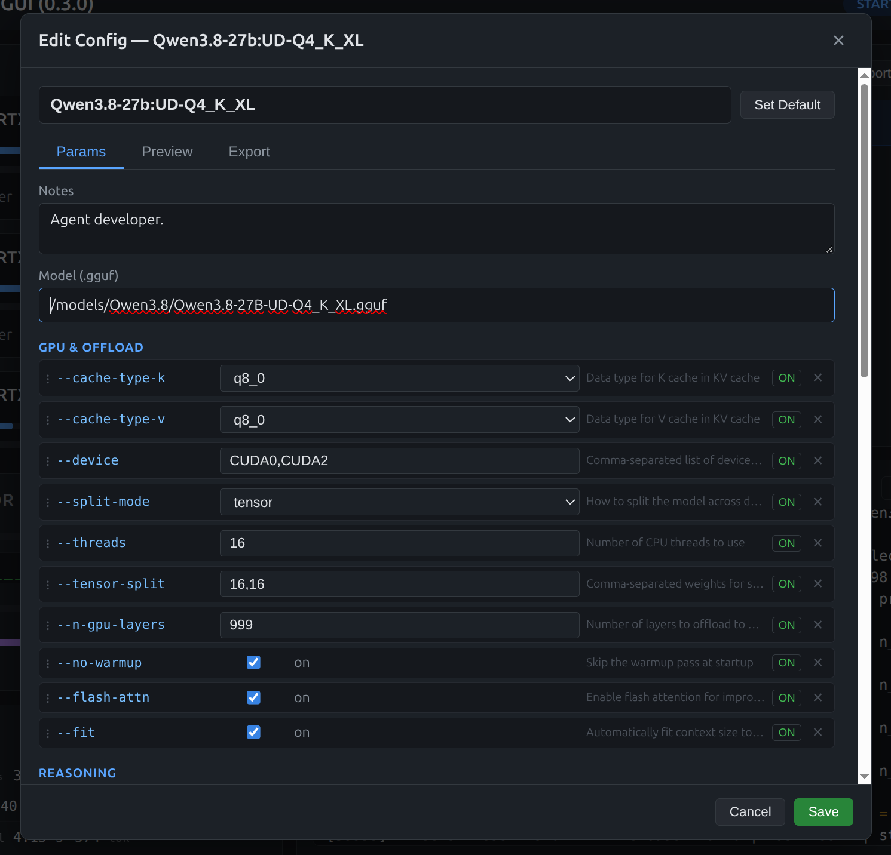
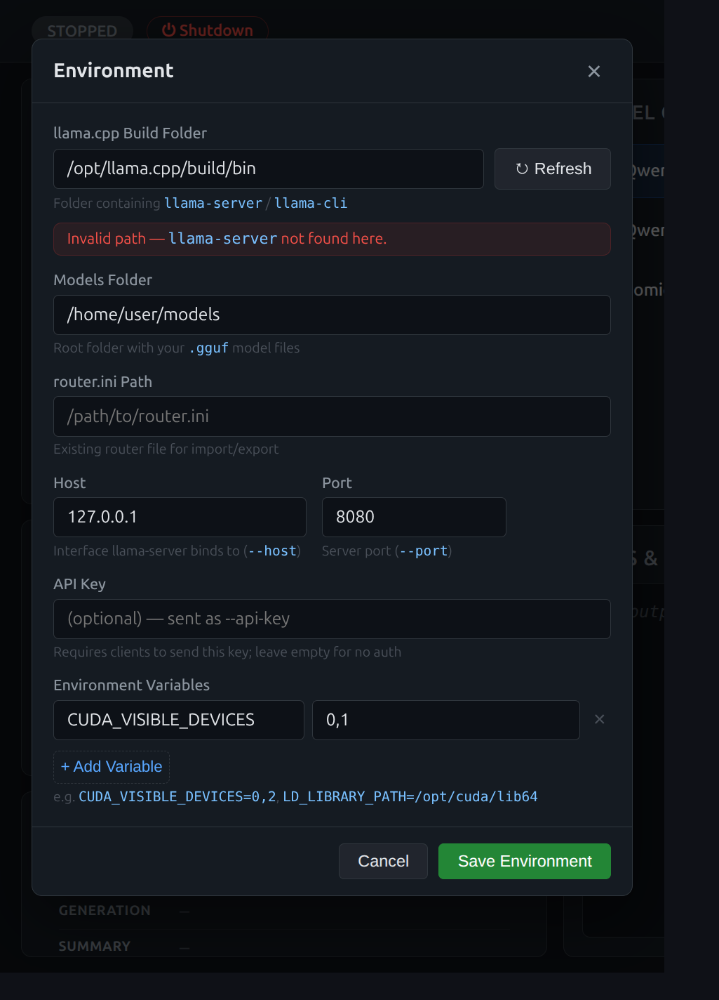

# llama.cpp Config GUI

[](https://github.com/deda-ca/llama-cpp-config-gui/actions/workflows/ci.yml)
[](LICENSE)
[](https://v3.vuejs.org/)
[](https://www.typescriptlang.org/)

A desktop-style web app for configuring and launching [llama.cpp](https://github.com/ggml-org/llama.cpp) inference, with a live GPU & system monitoring dashboard. Point it at your local `llama.cpp` build, manage named model configs (with notes), launch `llama-server` in single- or router-mode, and watch VRAM, temperatures, utilization, CPU, RAM and disk in real time.

<p align="center">
  
</p>

---

## Features

- **Config manager** — store multiple named model configs with free-text notes so you never lose a working setup. Clone, swap models under a stable alias, and set a default.
- **Full parameter editor** — every llama.cpp CLI flag (GPU offload, context/RoPE, sampling, reasoning, speculative decoding, multimodal, and more) with type-appropriate inputs, presets, drag-to-reorder, and per-parameter enable/disable.
- **Router launch** — tick the models you want, click **Launch (N)**, and the app generates a `router.ini` preset and starts `llama-server` in router mode so dev tools can hit any model on one port.
- **Import / Export** — round-trip with an existing `router.ini`. Disabled parameters are written as comments so you can flip options without losing them.
- **Live monitoring** — per-GPU VRAM, temperature, utilization and power (via `nvidia-smi`), plus CPU, RAM and disk usage.
- **Logs & metrics** — live process log stream with parsed prefill / generation tokens-per-second and a model status panel.
- **Environment config** — set the llama.cpp build folder, models folder, host/port, API key and per-launch environment variables (e.g. `CUDA_VISIBLE_DEVICES`).

<p align="center">
  
</p>

## Requirements

- **Node.js** ≥ 20 (for development)
- A local **llama.cpp build** — a folder containing `llama-server` / `llama-cli` (the app spawns these; it does not bundle them)
- **NVIDIA GPU + `nvidia-smi`** for the GPU monitor (optional — the rest of the app works without it)

## Quick start

### From source

```bash
git clone https://github.com/deda-ca/llama-cpp-config-gui.git
cd llama-cpp-config-gui
npm install
npm run dev          # starts the API server + Vite client together
```

Open the URL printed by Vite (default `http://localhost:5173`). On first run, open **⚙ Env** and point the app at your llama.cpp build folder and models folder.

### Release binary

A single self-contained executable is produced by the release script (built with Bun):

```bash
npm run release      # → release/llama-cpp-config-gui
./release/llama-cpp-config-gui
```

The binary serves the built client from memory and opens your browser automatically. Set `PORT` to change the port and `NO_BROWSER=1` to skip auto-launching a browser.

## How to use

1. **Configure the environment** — click **⚙ Env** in the *Model Configs* toolbar. Set the llama.cpp build folder (use **↻ Refresh** to detect the version), your models folder, host/port, and any environment variables.
2. **Create a config** — click **+ New**, pick a template (or start blank), set the alias and model file, then add parameters with the searchable **Add Parameter** picker. Add notes about performance or use case.
3. **Launch** — for a single model, tick its checkbox and click **Launch (N)**. The app writes a `router.ini` preset from the selected models and starts `llama-server` in router mode. Watch the live logs, metrics and GPU dashboard while it runs; click **Stop** to shut it down.
4. **Export / Import** — use **Export** to write all (or the selected) configs back to a `router.ini`, or **Import** to load an existing one.

<p align="center">
  
</p>

## Configuration reference

Configs are stored in `.config/` (created automatically on first run):

| File | Purpose |
|------|---------|
| `settings.json` | Environment config: llama.cpp path, models dir, host/port, API key, env vars, GPU poll interval |
| `models.json` | All model configs, templates, and the default config ID |
| `params.json` | Parameter reference (flag names, descriptions, types) — generated from the llama.cpp CLI README, refreshable from the UI |

Each model config maps to a router **alias** and holds an ordered set of parameters. The main parameter categories are:

- **GPU & Offload** — `--device`, `--tensor-split`, `--split-mode`, `--n-gpu-layers`, `--threads`, `--flash-attn`, `--cache-type-k/v`, `--fit`, …
- **Context & RoPE** — `--ctx-size`, `--rope-scaling`, `--rope-scale`, `--yarn-orig-ctx`
- **Sampling** — `--temp`, `--top-p`, `--top-k`, `--min-p`, `--presence-penalty`, `--repeat-penalty`, `--seed`
- **Reasoning** — `--reasoning`, `--reasoning-format`, `--reasoning-budget`, `--reasoning-effort`, …
- **Speculative decoding** — `--spec-type`, `--spec-draft-n-max`, `--model-draft`
- **Other** — `--mmproj`, `--jinja`, `--parallel`, `--port`, `--alias`, plus any unknown flags (kept as raw key/value pairs)

Unknown or experimental flags are preserved verbatim, so newer llama.cpp options keep working.

## Project structure

```
llama-cpp-config-gui/
├── index.html                  # Vite entry
├── vite.config.ts              # Dev server + /api proxy
├── tsconfig.json               # Frontend (Vue)
├── tsconfig.server.json        # Backend (Node)
├── scripts/build-release.ts    # Bun single-executable release build
└── src/
    ├── server/                 # Express API, GPU/system polling, process manager, log parser
    │   ├── index.ts            # Server entry + SSE event stream
    │   ├── gpu.ts              # nvidia-smi polling
    │   ├── system.ts           # CPU / RAM / disk sampling
    │   ├── llama.ts            # Process manager (spawn/stop llama-server)
    │   ├── logParser.ts        # Log line parsing + timing metrics
    │   ├── modelConfig.ts      # Config/template storage
    │   └── routerIni.ts        # router.ini import/export
    └── client/                 # Vue 3 SPA
        ├── App.vue             # Layout: GPU/system monitors, configs, logs
        └── components/         # GpuMonitor, SystemMonitor, ModelStatus, ConfigList, ConfigEditor, …
```

## Development

```bash
npm run dev          # server (tsx watch) + client (vite) concurrently
npm test             # run the Vitest suite once
npm run test:watch   # run tests in watch mode
npm run build        # build client (Vite) + compile server (tsc)
npm run release      # produce the single-file executable in release/
```

The dev Vite server proxies `/api` to the backend on `localhost:3001`. Real-time updates (GPU stats, logs, metrics, process status) are streamed over **SSE** (`GET /api/events`).

## License

MIT — see [LICENSE](LICENSE).
